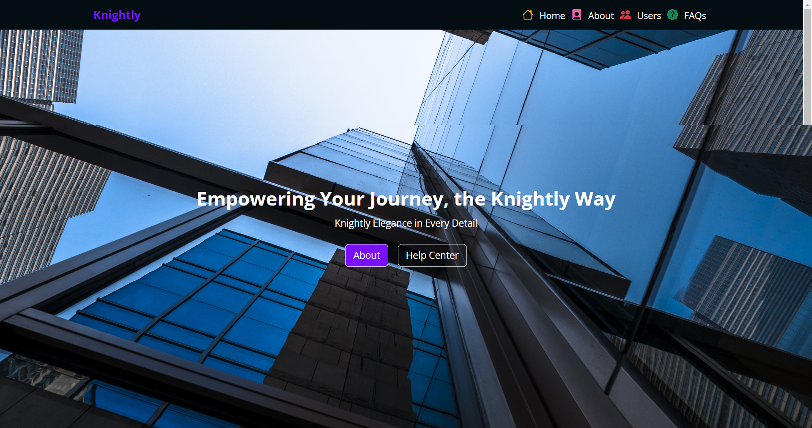
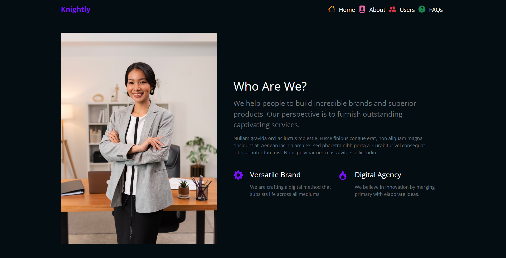
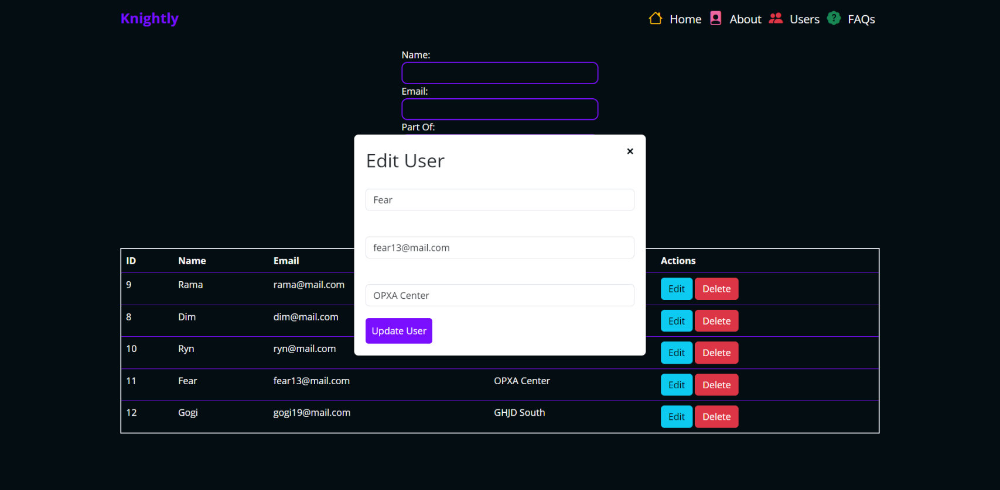
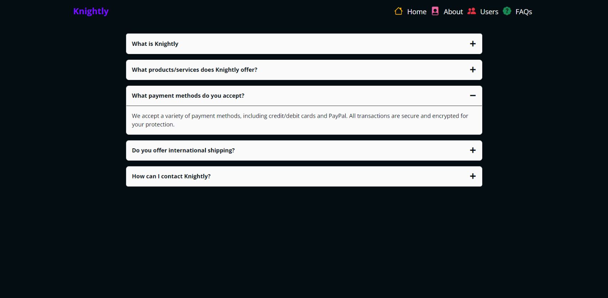

# Knightly - Company Management System

Knightly is a company management system designed to streamline various aspects of company operations. It allows you to perform CRUD (Create, Read, Update, Delete) operations on company data, providing a responsive user interface for a seamless experience.

## Screenshots



## Installation

To get started with Knightly, follow these installation steps:

1. Ensure you have [Node.js](https://nodejs.org/) and [Yarn](https://yarnpkg.com/) installed on your system.

2. Clone this repository to your local machine:

- https://github.com/dimasrdika/fullstack-crud.git

3. Navigate to the project directory:

4. Install the frontend and backend dependencies using Yarn:

- yarn install

## Screenshots



## Usage

To run Knightly, follow these steps:

1. Start the PostgreSQL database.

2. Start the backend server:

```bash
 cd backend
 yarn start
```

3. Start the frontend development server:

```bash
 cd frontend
 yarn start
```

4. Access the Knightly application in your web browser at `http://localhost:3000`

## Screenshots



## Features

Knightly offers the following key features:

- Create, Read, Update, and Delete (CRUD) operations on company data.
- Responsive user interface for seamless access on various devices.

## Screenshots



## License

This project is licensed under the MIT License. See the [LICENSE](LICENSE) file for details.

## Contribution Guidelines

We welcome contributions from the community. If you'd like to contribute to Knightly, please follow me [@dimasrdika](http://github.com/dimasrdika)

## Contact Information

If you have any questions or need support, please contact me at [dimasrachmadika@gmail.com](Dimas:dimasrachmadika@gmail.com)
